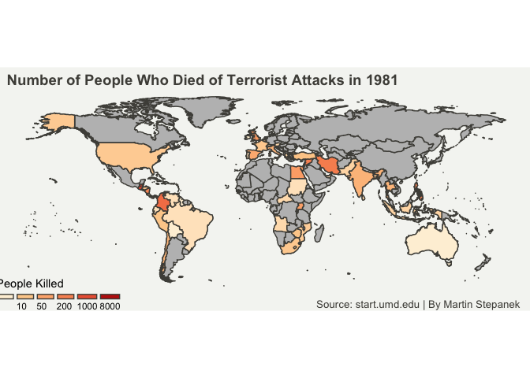

Global Terrorism
================
23 April, 2018

-   [General Goals](#general-goals)
-   [Data](#data)
    -   [Reading Data In](#reading-data-in)

<!-- README.md is generated from README.Rmd. Please edit that file -->
General Goals
-------------

This is a simple RStudio project that Eric Anderson has put together as an example/template for students to get a sense of what he expects them to do in terms of assembling their data for the 2017 EEB 295 course, "[Case Studies in Reproducible Research](https://eriqande.github.io/rep-res-eeb-2017/)".

The general goals of this project (for our purposes at the moment) are fairly straightforward. We want to use pedigree information to summarize the ages and distributions of family sizes of coho returning to Klamath River hatcheries. etc. etc.

Data
----

The data for this project are all housed in the `./data` directory. There are two main types of files:

1.  There are three files which are output files from the program [SNPPIT](https://github.com/eriqande/snppit). These are `snppit_output_ParentageAssignments_2013Juvs.txt`, `snppit_output_ParentageAssignments_2014Juvs.txt`, and `snppit_output_ParentageAssignments_2015Juvs.txt`. These are TAB-delimited text files which give the inferred trios (Father-Mother-Offspring) of hatchery coho salmon in our Shasta River Project. These files use "---" to denote columns that have missing data. These result from analyses made on the genetic data. In a real reproducible example, we would have started from the genotype data and actually run the SNPPIT analyses reproducibly, as well. But, for an example, it will be simpler to start from these simple, intermediate files.

2.  There is one data file of extra metadata that should include all the individuals in the snppit output files (and probably a few extra ones as well.) The main key between this file and the other ones is the NFMS\_DNA\_ID which is part of the ID in the Kid, Ma, and Pa columns in the `snppit_output*` files.

### Reading Data In

#### SNPPIT files

The SNPPIT files can be read in with `read_tsv()` making note of the missing data "---".

``` r
library(dplyr)
library(tidyverse)
library(mapdata)
library(maps)
library(RColorBrewer)
library(gganimate)

gt <- read_csv("data/database.csv")

gtclean <- gt %>%
  filter(crit1 == 1, crit2 == 1, nkill > 0) %>%
  group_by(country_txt, iyear, nkill) %>%
  summarise(
    count = n(),
  ) %>% 
  mutate(
    killed = nkill * count
  ) %>% 
  group_by(country_txt, iyear) %>%
  summarise(killed = sum(killed))

skilled <- gtclean %>% 
  group_by(iyear) %>% 
  summarise(killed = sum(killed))

myPalette <- colorRampPalette(rev(brewer.pal(6, "OrRd")))
```


``` r
worldmap <- map_data("world")
newworld <- worldmap %>%
  filter(region != "Antarctica")
newworld$region <- recode(newworld$region
                          ,'USA' = 'United States'
                          ,'UK' = 'United Kingdom'
)

world <- ggplot() +
  geom_polygon(data = newworld, aes(x = long, y = lat, group = group), fill = "grey", color = "#4e4d47") + 
  coord_quickmap() +
  theme_void()

grouped <- inner_join(newworld, gtclean, by = c('region' = 'country_txt')) %>%
  filter(region != "Antarctica") 

map <- world +
  geom_polygon(data = grouped, aes(x = long, y = lat, group = group, fill = killed, frame = iyear), color = "#4e4d47") +
  coord_quickmap() +
  scale_fill_gradientn(colours = rev(myPalette(5)),
                       na.value="#4e4d47",
                       breaks = c(1, 10, 50, 200, 1000, 8000),
                       trans = "log10",
                       name = "People Killed",
                       guide = guide_legend(keyheight = unit(2, units = "mm"), keywidth=unit(6, units = "mm"),
                                            label.position = "bottom", title.position = 'top', nrow=1)) +
  theme_void() +
  theme(plot.title = element_text(size = 14, hjust = 0.05, face = "bold", color = "#4e4d47"),
        plot.caption = element_text(size = 10, hjust = 0.97, vjust = 1.2, color = "#4e4d47"),
        legend.position = c(0.11, 0.01),
        plot.background = element_rect(fill = "#f5f5f2", color = NA)) +
  scale_colour_brewer(palette = "Set1") +
  labs(title = "Number of People Who Died of Terrorist Attacks in",
       caption="Source: start.umd.edu | By Martin Stepanek")
```


``` r
gganimate(map, ani.width = 900, ani.height = 500)
```



Of course, if we wanted to read them all in at once and make a tidy frame of all of them

#### The Meta Data

This file is actually an interesting example because it has column names with single quotes (who did that?) and also with "\#" symbols. If we read this with base R's `read.csv()` it will mangle those names. The `readr` functions never do that. There are also clearly some problems, which we will get to later
